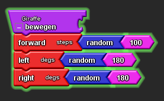

# Informatikprojekt-2-Nele-und-Marit

[22/11/17, 1. Stunde](#1)

[24/11/17, 2. und 3. Stunde](#2)

[01/12/17, 4. und 5. Stunde](#3)

[06/12/17, 6. Stunde](#4)

[08/12/17, 7. und 8. Stunde](#5)

[15/12/17, 9. und 10. Stunde](#6)

[17/01/18, 11. Stunde](#7)

[19/01/18, 12. und 13. Stunde](#8)

[24/01/18, 14. Stunde](#9)

[26/01/18, 15. Stunde](#10)

[31/01/18, 16. Stunde](#11)

[02/02/18, 17. und 18. Stunde](#12)

## Erste Stunde 

Wir haben uns dazu entschiedenals nächstes Projekt eine Lernaktivität mit StarlogoTNG zu machen.
Zuerst haben wir uns mit dem Spaceland vertraut gemacht, und gelernt, wie wir zwischen verschiedenen Ansichten wechseln können. Ebenfalls klickten wir uns durch die verschiedenen Blöcke des Menus, um ein Gefühl für die möglichen Aktionen, die ein Agent erfüllen kann, zu bekommen.

## Zweite und dritte Stunde  (Doppelstunde)

### Lernaktivität eins:

In der ersten Lernaktivität haben wir zwei verschiedene Agentenarten erstellt: eine Schildkröte und einen Elefanten.
Dann haben wir die Schildkröte mit Hilfe des "forever"-Blocks immer im Quadrat laufen lassen:

Hierbei geht der Agent immer zwei Schritte geradeaus und dreht danach um 90 Grad.

### Lernaktivität zwei:

Zunächst haben wir eine Variable definiert, die eine bestimmte Anzahl von Schildkröten erzeugt. Um die Variable zu benutzen setzten wir sie unter den "setup"-Block. Den Slider fügen wir im Schildkröten Feld hinzu. Damit die Schildkröten sich zufällig im Spaceland bewegt, benutzen wir zwei "random-Blöcke":

Die Schildkröte läuft zufällig Schritte. Dass geschied da das Programm eine Zahl zwischen 0-100 auswählt. Dies hat zur Folge, dass die Schildkröten teilweise größere Sprünge in ihrer Schrittfolge hat. Zusätzlich dreht diese sich zufällig in einer Winkelspanne von 0-360 Grad. So hat sie die Möglichkeit sich komplett um die eigene Achse zu drehen.

Um die Schildkröten nun miteinander sprechen zu lassen, wenn sie aufeinandertreffen, haben wir einen "collision-Block" benutzt. In diesem haben wir zwei "say"-Blöcke verwendet:

Wenn jetzt eine Schildkröte mit einem Elfanten aufeinander trifft, sagt die Schildkröte: "Hey", und der Elefant: "Hallo".

## Vierte und fünfte Stunde  (Doppelstunde)

### Lernaktivität drei:

#### Aufgabe eins

Zunächst haben wir einen "create-do"-Block verwendet, um alle 100 Schildkröten rot zu färben. 

Wird die Schildkröte nun angeklickt sagt sie, welche Farbe sie hat. Außerdem lässt sich im swap view verfolgen, wie viel der Schildkröten (hier alle) rot gefärbt sind.

Um drei verschiedene Farben zu erhalten, haben wir zusätzlich zwei "if"-Blöcke und eine Variablen benutzt.

Im vorangestellten Screenshot sind zunächst alle Schildkröten rot gefärbt worden. Von diesen roten Agenten wurden im folgenden Schritt 1/3 grün gefärbt. Um nun drei Farben zu erhalten, färbten wir von dem Drittel wieder 1/3 lila.

Um nun jedoch von jeder Farbe 1/3 zu erhalten, wendenten wir einen anderen Ansatz. (Siehe vierzehnte Stunde.)

#### Aufgabe zwei

Wir benutzten einen "collision"-Block, damit die Schildkröten gelb werden, wenn sie aufeinander stoßen:

Hierbei sind zunächst alle Schildkröten Agenten rot und werden durch die Collisionen gelb.

#### Aufgabe drei

Die Aufgabe bestand darin, die Schildkröten verschwinden zu lassen, wenn sie sich treffen. Hierzu haben wir einen "if-then"-Block benutzt. Als Bedingung haben wir eingesetzt, dass wenn die Schildkröte die gleiche Farbe habt, wie die mit der sie kollidiert, sollen diese sterben. Da die Schildkröten durch das gesamte Spaceland laufen treffen diese sich nach einer gewissen Zeit alle, so dass keine Schildkröten mehr vorhanden sind.

## Sechste Stunde 

### Lernaktivität vier:

#### Aufgabe eins

Wir benutzen den "clear everyone"-Block, um alle Agenten zu entfernen. Dann entfernten wir den Block der Schildkröten. Nun hatten wir nur noch einen Elefanten, den wir programmieren können. Der Elefant besitzt die Farbe grau.

#### Aufgabe zwei

Die zweite Aufgabe bestand darin, einen Actor so zu programmieren, dass er sich mit den Pfeiltasten steuern lässt. Hierzu benutzten wir im "forever"-Bereich mehrere "if-test-then"-Blöcke. Als if-Bedingung setzten wir die jeweiligen Pfeiltasten ein.
In den Block für die rechte Pfeiltaste setzten wir unter "then" den Befehl, sich um 90° nach rechts zu drehen, und dann einen Schritt nach vorne zu gehen.

Für die linke Pfeiltaste setzten wir die selben Blöcke ein, mit einer Drehung nach links anstelle von rechts.
In den "then"-Bereich des "if"-Blockes für die obere Pfeiltaste setzen wir nur den Befehl "forward" ein, kombiniert mit dem Parameter 1.

Für die untere Pfeiltaste programmierten wir, dass der Agent sich rückwärts bewegt.

Aktiviert man nun im Spaceland den "forever"-Block, so lässt der Elefant sich mit den Pfeiltasten steuern. Drückt man die rechte oder linke Pfeiltaste, so dreht er sich in die entsprechende Richtung, um ihn aber beispielsweise nach rechts laufen zu lassen, muss man zunächst einmal die rechte Pfeiltaste und dann die obere drücken. Würde man nur die rechte mehrmals drücken, so würde er objektiv von oben betrachten nicht nach rechts laufen, sondern sich nur immer wieder um 90° nach rechts drehen, und dann einen Schritt nach vorne machen.

## Siebte und achte Stunde Stunde  (Doppelstunde)

Zunächst haben wir die Benotung unserer ersten Projekte erhalten. Wir konnten fragen stellen und uns Teilbenotungen näher erläutern lassen.

Danach haben wir uns mit der Klasse gemeinsam einen Text der Verfasser von "TheBeautyAndJoyOfComputing" angeguckt, da Herr Buhl uns das Programm für die nächste Projekteinheit vorstellen wollte. 

Anschließend haben wir die vierte Lernaktivitat unseres Projektes fortgeführt.

#### Aufgabe drei

Damit der Agent, in unserem Fall ein Elefant, Blöcke einsammeln kann, mussten wir zunächst welche kreieren.
Hierzu erstellten wir unter "Edit Breeds" eine neue Klasse, den Block.
Nun fügten wir im Setup-Bereich einen "create-Do"-Block für die Agentenklasse "Block" hinzu.
Wir definierten im Bereich des Blockes einen Slider. Damit wir diesen auch benutzten können, mussten wir im Setup-Bereich dem "create-Do"-Block des Blockes noch die Aufforderung hinzufügen, eine Anzahl von Blöcken mit dem Slider zu kreieren.

Damit der Elefant Blöcke einsammeln und etwas sagen kann, benutzten wir einen "collision"-Block. Beim Block fügten wir "die" hinzu, beim Elefanten "say" und "Ohh, ein Block!". 
Nun kann man den Elefanten im Spaceland so steuern, dass er auf Blöcke trifft. Passiert dies, soverschwindet der Block, und der Elefant sagt: "Ohh, ein Block!"

### Lernaktivität fünf

Die Aufgabe in Lernaktivität fünf bestand darin, einen Wald zu erzeugen, in dem der steuerbare Agent herumlaufen kann. Der Agent sollte auf die Bäume heraufklettern können. Aufgabe des Agenten sollte es sein, einen Schlüssel zu finden, mit dem er sich Zutritt zu einem Gebäude verschaffen kann.

Zunächst erstellten wir den Wald, in dem der Agent sich bewegen soll:

Als erstes haben wir unter "Edit Breeds" zwei neue Agentenklassen erstellt: Laubbäume und Tannen.

Um nun mit den Bäumen einen Wald zu kreieren, setzten wir im Setup-Bereich zwei neue "create"-Blöcke ein. Wir erstellten 100 Laubbäume und 60 Tannen, um ein stimmiges Bild zu erhalten:

## Neunte und zehnte Stunde  (Doppelstunde)

In diesen Stunden haben wir uns damit beschäftigt, den Agenten so zu programmieren, dass er auf die Bäume klettern kann.
Hierzu haben wir zwei "collision"-Blöcke (für jede Baumart einen) benutzt. Wir benutzten "if-test-then"-Blöcke, setzten als Bedingungen jeweils eine Pfeiltaste ein, und benutzten "up" und "down". Nun konnten wir den Elefanten wenn er auf einen Baum traf mit den Pfeiltasten nach oben oder unten bewegen.
Bei dieser Methode, den Agenten zu programmieren, ergab sich nun das Problem, dass der Elefant sich wenn er auf den Baum geklettert war, von der Stelle bewegte. Da die "up"- und "down"-Befehle aber nur in dem Moment funktionierten, in dem der Elefant mit einem Baum kollidierte, konnte man den Elefanten nun nicht mehr auf den Bodenzurück bringen.
Um dieses Problem zu lösen, suchten wir nun nach einer Möglichkeit, die normale Richtungssteuerung über die Pfeiltasten zu deaktivieren, wenn der Elefant mit einem Baum kollidiert.

Wir haben hierzu eine neue Variable eingeführt, die wir "IstImBaum" genannt haben. Den Setup-Bereich haben wir dann zunächst so programmiert, dass die Variable am Anfang auf "false" gesetzt wird. Unter dem "Collision"-Block haben wir dann unter dem Befehl, sich beim Drücken der Pfeiltaste nach oben zu bewegen noch den Befehl hinzugefügt, die Variable auf "true" zu setzten.
Nach dem Herunterklettern vom Baum wird die Variable wieder als "false" wiedergegeben.
Damit die Richtungssteuerung mit den Pfeiltasten deaktiviert wird, wenn der Elefant sich im Baum befindet, haben wir im "forever"-Block noch eine "if-test-then"-Bedingung hinzugefügt, nach der die Steuerung über nich Pfeiltasten nur dann funktioniert, wenn die neue Variable als "false" wiedergegeben wird.

## Elfte Stunde  

Die heutige Stunde haben wir damit verbracht, zuerst den Stundenblock der letzten Stunde zu vervollständigen.
Da die letzte Stunde vor den Ferien war, mussten wir uns wieder in das Programm einarbeiten, und uns ins Gedächtnis rufen, was wir bisher gemacht hatten.

Außerdem haben wir eine Burg als neuen Agenten erstellt.

## Zwölfte und Dreizehnte Stunde  (Doppelstunde)

Zuerst zeigte uns Herr Buhl eine Möglichkeit, die Kollisionen des Elefanten mit den unterschiedlichen Bäumen platzsparender und übersichtlicher zu programmieren: Wir erstellten eine neue "Procedure", welche wir "climbTree" nannten. Hierunter haben wir dann den Block, der die Steuerung des Elefanten bei Kollision mit einem Baum programmiert gesetzt. In die Kollisionsblöcke konnten wir dann einfach den "climbTree"-Block setzten.

Als nächsten haben wir weiter daran gearbeitet, dass Spiel aus der Lernaktivität zu programmieren. Hierzu haben wir zunächst einen neuen Agenten, die Karotte, erstellt. Sie soll im weiteren Verlauf des Spieles als Schlüssel für die Burg fungieren.

Im "setup"-Bereich haben wir dann Befehle hinzugefügt, die eine Karotte und eine Burg erstellen.
Dann haben wir einen neuen Kollisionsblock zwischen dem Elefanten und der Karotte erstellt. Mit dem "die"-Block haben wir programmiert, dass die Karotte bei einem Zusammenstoß verschwindet. Außerdem erstellten wir den Boolean "hatKarotte" für den Elefanten. Im "setup"-Berich legten wir fest, dass dieser am Anfang des Spieles als "false" wiedergegeben wird. Unter dem eben erwähnten Kollisionsblock legten wir fest, dass der Boolean wenn die beiden Agenten zusammenstoßen auf "true" gesetzt wird.
So haben wir programmiert, dass der Elefant die Karotte aufsammeln kann.

Damit er dann auch die Burg betreten kann, haben wir einen zweiten Kollisionsblock benutzt. Mit Hilfe eines "if-test-then"-Blockes ließen wir dass Programm testen, ob der Boolean "hatKarotte" als "true" wiedergegeben wird. Ist dies der Fall, so lassen wir den Elefanten mit dem "die"-Block verschwinden, also die Burg betreten.#

Um unser Spiel zu vervollständigen haben wir zuletzt noch unter dem Kollisionsblock des Elefanten mit der Burg einen "say"-Block für die Burg hinzugefügt. Wenn der Elefant nun mit der Burg kollidiert, sieht es so aus, als würde er die Burg betreten, und von innen "Juhuu!! Mission completed." rufen.

## Vierzehnte Stunde 

Herr Buhl wies uns auf einen Fehler in der ersten Aufgabe der dritten Lernaktivität hin: Unser Ziel war es, die Schildkröten zu gleichmäßigen Teilen in drei verschiedenen Farben zu färben. Hierzu hatten wir "random"-Blöcke benutzt, mit denen zuerst ein Drittel der Schildkröten grün gefärbt wurde. Mit einem zweiten Block haben wir wieder ein Drittel Lila gefärbt. Hierbei haben wir nicht bedacht, dass im Endergebnis dann zwar ein Drittel der Schildkröten lila ist, dafür aber mehr als ein Drittel die ursprüngliche Farbe behält, während weniger als ein Drittel grün bleibt.

Um den Fehler zu beheben, haben wir zunächst die Hälfte der Schildkröten grün gefärbt, und dann ein Drittel der gesamten Schildkröten lila. Auf diese Weise haben wir erreicht, dass am Ende jeweils ungefähr ein Drittel der Schildkröten die gleiche Farbe hat.

## Fünfzehnte Stunde 

### Lernaktivität sechs:

Das Ziel dieser Lernaktivität besteht darin, eine Ego-Shooter zu programmieren, in dem ein Agent mit Paintbällen auf andere Agenten schießt, welche dann die Farbe des Balles annehmen.
Zuerst haben wir zwei neue Agentenarten, den Paintball und den Luigi erstellt. Im "Setup"-Bereich erstellten wir nun einen Luigi.

Als nächstes lernten wir, mit Hilfe der "hatch"-Funktion einen zweiten Luigi zu erzeugen, wenn die "space"-Taste gedrückt wird. Wir legten die Position dieses Luigis mit einem "forward"- und einem "setAltitude"-Block fest. Danach änderten wir die Rasse des Agenten in "Paintball" und färbten ihn mit Hilfe des "setColor"-Blockes grün.

## Sechzehnte Stunde 

Als erstes änderten wir heute die Farbe des Paintballs von grün zu rot, damit man ihn vor dem grünen Hintergrund besser sieht.
Außerdem änderten wir seine Größe mit Hilfe eines "setSize"-Blockes von 1 auf 0,2.

Damit der Paintball sich bewegt haben wir eine neue Prozedur erstellt, die wir "fliegen" genannt haben. Zusätzlich haben wir eine neue Agentenart, die Giraffen, erstellt. Im "setup"-Bereich haben wir dann programmiert, dass 25 weiße Giraffen erstellt werden. Auch für die Giraffen erstellten wir eine Prozedur, die wir "bewegen" nannten. Hier programmierten wir, dass die Giraffen sich relativ zufällig im Spaceland bewegen.

Als nächstes erstellten wir eine Kollisionsblock, für eine Kollision zwischen den Paintbällen und den Giraffen. Wir benutzen einen "setColor"-Block, um die Giraffe rot zu färben, nachdem sie von einem Paintball getroffen wurde. Damit der Paintball dann  verschwindet benutzten wir einen "die"-Block:

## Siebzehnte und Achzehnte Stunde  (Doppelstunde)

So wie wir unser Programm programmierten funktionierte es zwar, allerdings bewegten die Giraffen sich sehr viel schneller als Luigi und die Paintbälle. Dies lag an der Art, auf die wir die Bewegung der Giraffen programmiert hatten. Wir ließen sie willkürlich bis zu hundert Schritte auf einmal gehen, während Sowohl Luigi, als auch die Paintbälle immer nur einen Schritt zur Zeit gingen. Um das Problem zu beheben änderten wir also die Schrittzahl der Giraffen ebenfalls auf eins und verkleinerten die Gradzahlen, um die sie sich ufällig drehten. Um unser Programm übersichtlicher zu gestalten, fassten wir außerdem die beiden Befehle für die Links-, beziehungsweise die Rechtsdrehung zu einem Befehl zusammen. Hierzu benutzen wir nur einen "right"-Block, und benutzen einen "random"- und einen "math"-Block, damit die Giraffen sich willkürlich um -90° bis +90° drehen:

### Lernaktivität sieben

Die Aufgabe dieser Lernaktivität bestand darin, unser Paintball-Spiel weiter zu entwickeln.

Wir entschlossen uns dazu, noch eine weitere Agentenart, die Löwen, zu erstellen. Diese sollten Luigi fressen können. Wenn ein Löwe Luigi frisst, sollte das Spiel vorbei sein.

